# VAST RAG: Semantic Search for VAST Data Documentation

A production-ready MCP (Model Context Protocol) server that provides fast, local semantic search over VAST Data technical documentation using ChromaDB and sentence-transformers. This system enables Claude and other AI tools to access your complete documentation repository with natural language queries, all without any external API calls.

## What is VAST RAG?

VAST RAG combines **Retrieval-Augmented Generation (RAG)** with the **Model Context Protocol (MCP)** to create a local, self-contained semantic search system. Unlike traditional keyword-based search, VAST RAG understands the semantic meaning of your queries and documents, finding relevant information even when exact keywords don't match.

### Why Local RAG Matters

- **Privacy**: All documents remain on your machine. No data is sent to external services.
- **Cost**: No API calls to vector databases or language model services.
- **Speed**: Latency measured in milliseconds, not seconds.
- **Reliability**: Works offline. No dependency on cloud services.
- **Control**: You choose which documents to index and how to organize them.

### What is the Model Context Protocol (MCP)?

MCP is a standardized protocol that allows AI assistants like Claude to securely invoke custom tools and access resources on your local system. VAST RAG implements MCP tools that Claude can use to search your documentation, making your knowledge accessible directly within conversations.

## System Architecture

```mermaid
graph TD
    subgraph "Document Ingestion Pipeline"
        A["📂 Source Documents<br/>(~/projects/RAG/)"]
        B["👁 File Watcher<br/>(watchdog)"]
        C["🔍 Parser Factory<br/>(format detection)"]
        D["📄 Format Parsers<br/>(PDF/MD/HTML/DOCX/text)"]
        E["✂️ Semantic Chunker<br/>(500 tokens, 50 overlap)"]
        F["📊 Hash Index<br/>(SHA-256 change detection)"]
    end

    subgraph "Indexing & Storage"
        G["🤖 Embedding Service<br/>(BAAI/bge-base-en-v1.5)"]
        H["🗂️ ChromaDB Vector Store<br/>(dual collections)"]
        I["📑 vast-data collection<br/>(VAST product docs)"]
        J["📚 general-tech collection<br/>(other technical docs)"]
    end

    subgraph "Query Pipeline"
        K["🎯 User Query"]
        L["🔀 Query Embedding<br/>(same model)"]
        M["🔎 ChromaDB Similarity Search<br/>(L2 distance → 0-1 score)"]
        N["📋 Result Aggregation<br/>(with metadata)"]
    end

    subgraph "MCP Server & Client"
        O["🛠️ MCP Server<br/>(stdio interface)"]
        P["💬 Claude Desktop<br/>(or other MCP client)"]
    end

    subgraph "MCP Tools"
        Q["🔍 search_docs"]
        R["📋 list_collections"]
        S["📄 get_document"]
    end

    subgraph "Storage Locations"
        T["~/.claude/rag-data/<br/>chroma/ (database)<br/>logs/ (rotating)<br/>model-cache/ (embeddings)"]
    end

    A -->|monitors| B
    B -->|detects changes| F
    F -->|new/changed files| C
    C -->|routes to parser| D
    D -->|parsed content| E
    E -->|text chunks| G
    G -->|768-dim vectors| H
    H -->|stores in| I
    H -->|stores in| J

    K -->|user query| O
    O -->|embedding| L
    L -->|vector search| M
    M -->|semantic results| N
    N -->|returns via| Q
    O -->|list call| R
    O -->|document call| S
    Q -->|MCP tool| P
    R -->|MCP tool| P
    S -->|MCP tool| P

    H -.->|persists to| T

    style A fill:#e1f5ff
    style H fill:#fff3e0
    style O fill:#f3e5f5
    style P fill:#e8f5e9
```



## Pipeline Details

### Indexing Pipeline

The indexing pipeline automatically discovers, processes, and indexes documents whenever they are added or modified in the source directory.

#### 1. File Watcher (watchdog)

The system uses the `watchdog` library to monitor `~/projects/RAG/` for file system events. When a new document is added or modified, the watcher immediately triggers the parsing pipeline. This enables live-reload functionality—documents are searchable within seconds of being added to the directory.

The file watcher tracks all file system events and filters for supported document formats (PDF, Markdown, HTML, DOCX, plain text, and common code files).

#### 2. Parser Factory and Format-Specific Parsers

When a file is detected, the parser factory examines its extension and content to determine the appropriate parser. VAST RAG includes specialized parsers for each supported format:

- **PDFParser**: Extracts text using PyPDF2 with pdfplumber as a fallback. Preserves page numbers for citation purposes.
- **MarkdownParser**: Extracts sections and hierarchy from Markdown files, preserving structure metadata.
- **HTMLParser**: Uses BeautifulSoup to parse HTML, strips script and style tags, and extracts clean text.
- **DOCXParser**: Parses Microsoft Word documents using python-docx.
- **TextParser**: Handles plain text files and common code formats (Python, JavaScript, Java, etc.).

Each parser returns a `ParsedDocument` object containing the full text content and metadata (title, source file, modification date).

#### 3. Semantic Chunker

Raw documents can be very large—a single PDF might contain 100+ pages. The semantic chunker divides documents into manageable chunks optimized for semantic search. The chunker uses the following strategy:

- **Token-based sizing**: Uses tiktoken to count actual tokens. Each chunk is approximately 500 tokens (roughly 300-400 words, depending on language).
- **Overlap for context**: Each chunk overlaps with the previous by 50 tokens, ensuring that semantic boundaries don't split related concepts across chunks.
- **Metadata preservation**: Each chunk retains its source file, section information, and page number (if available).

This approach balances two competing needs: chunks must be small enough to be semantically coherent but large enough to contain sufficient context.

#### 4. Hash Index and Idempotent Indexing

To avoid re-embedding the entire document collection on every run, VAST RAG maintains a SHA-256 hash index of all processed files. Before processing a document, the system compares the current file's hash against the stored hash. If they match, the file is skipped; if they differ, the file is re-parsed and re-embedded.

This makes indexing idempotent and efficient—re-running the indexer only processes changed files.

#### 5. Embedding Service

The embedding service uses the BAAI/bge-base-en-v1.5 model to convert text chunks into 768-dimensional vector embeddings. This model is specifically trained for semantic search and performs well across general and technical content.

Key design choices:

- **Lazy loading**: The model is only downloaded and loaded when first needed (either during indexing or the first query). This keeps startup time fast.
- **Batch processing**: Embeddings are computed in batches of 32 chunks by default, balancing memory usage and speed.
- **Automatic caching**: Downloaded models are cached in `~/.claude/rag-data/model-cache/` to avoid re-downloading on subsequent runs.

#### 6. Dual Collection Storage (ChromaDB)

Embeddings are stored in a ChromaDB vector database with a deliberate dual-collection design:

- **vast-data collection**: Contains all documents related to VAST products (VastDB, VAST Data Engine, InsightEngine). Documents are automatically categorized based on file paths—any document with "vast" in the path is placed in this collection.
- **general-tech collection**: Contains all other technical documentation (architecture notes, design documents, external references, etc.).

This dual design provides these benefits:

- **Flexible scoping**: Users can search all documentation or narrow results to VAST-specific content only.
- **Improved relevance**: Keeping related documents together reduces semantic drift in search results.
- **Future extensibility**: The design easily accommodates additional specialized collections.

### Query Pipeline

When a user asks Claude a question that could benefit from searching your documentation, Claude invokes the `search_docs` MCP tool.

#### 1. Query Embedding

The user's query is embedded using the same BAAI/bge-base-en-v1.5 model that was used to embed documents. This ensures that queries and documents exist in the same vector space, making direct distance comparisons meaningful.

#### 2. Semantic Search in ChromaDB

The query vector is compared against all document chunk vectors using L2 distance (Euclidean distance). ChromaDB performs this search efficiently, returning the top-N most similar chunks.

ChromaDB returns raw distance values; these are converted to similarity scores using the formula: `similarity = 1 / (1 + distance)`. This converts distances in the range [0, ∞) to similarity scores in the range (0, 1], where 1 indicates perfect match and values close to 0 indicate dissimilarity.

#### 3. Result Aggregation and Ranking

Search results are returned in order of similarity score (highest first). Each result includes:

- **Text content**: The actual chunk of text, providing the answer or relevant information.
- **Source file**: The original document filename for citation.
- **Page number**: The page within the PDF (if available), for quick reference.
- **Section**: Extracted section heading (if the source document has hierarchical structure).
- **Similarity score**: The computed 0-1 similarity metric (for transparency and filtering).
- **Category**: Whether the source document is in vast-data or general-tech collection.

### Logging and Observability

All system activity is logged to `~/.claude/rag-data/logs/vast-rag.log`. The log file uses rotating file handler with a maximum of 10 MB per file and 5 backup files retained. Logs are written to stderr (not stdout) because the MCP server communicates over stdio with Claude Desktop.

## MCP Tools

The VAST RAG MCP server exposes three core tools that Claude and other MCP clients can invoke:

### search_docs

Performs semantic search across indexed documents.

**Parameters:**
- `query` (string, required): The search query in natural language. Examples: "How do I optimize VastDB queries?", "What is the VAST Data Engine architecture?", "Memory management in distributed systems"
- `category` (string, optional): Filter results to a specific collection. Valid values: `"vast-data"`, `"general-tech"`, or omit for all collections.
- `n_results` (integer, optional): Number of results to return. Default: 5. Maximum: 20.

**Returns:** Array of search results, each containing:
```json
{
  "text": "The chunk of text matching your query...",
  "source": "vdb-optimization.pdf",
  "score": 0.87,
  "category": "vast-data",
  "page": 42,
  "section": "Query Execution Planning"
}
```

**Example Usage (via Claude):**
```
"Search the VAST documentation for information about query optimization.
Use the search_docs tool with category='vast-data' to find relevant content."
```

### list_collections

Lists all available collections and their document counts.

**Parameters:** None

**Returns:** Object containing collection metadata:
```json
{
  "collections": [
    { "name": "vast-data", "count": 1234 },
    { "name": "general-tech", "count": 456 }
  ],
  "total_chunks": 1690
}
```

**Purpose:** Helps users understand what documentation is available and how much content has been indexed.

### get_document

Retrieves full metadata and information about a specific indexed document.

**Parameters:**
- `source_file` (string, required): The filename or path of the document (as returned by search_docs).
- `category` (string, required): The collection containing the document (`"vast-data"` or `"general-tech"`).

**Returns:** Document metadata object (first matching chunk):
```json
{
  "id": "vdb-architecture.pdf_chunk_0",
  "source": "vdb-architecture.pdf",
  "text": "First chunk of text from the document...",
  "metadata": {
    "source_file": "vdb-architecture.pdf",
    "category": "vast-data",
    "chunk_index": 0
  }
}
```

**Purpose:** Allows users to examine a complete document or verify that a specific source file is indexed.

## Project Structure

```
vast-rag/
├── README.md                          # This file
├── LICENSE                            # License information
├── pyproject.toml                     # Python project metadata and dependencies
├── pytest.ini                         # pytest configuration
│
├── src/vast_rag/
│   ├── __init__.py                    # Package initialization
│   ├── __main__.py                    # python -m vast_rag entry point
│   ├── server.py                      # Production MCP entry point (stdio)
│   ├── config.py                      # Pydantic configuration with env var support
│   ├── types.py                       # TypedDict and dataclass definitions
│   ├── indexer.py                     # DocumentIndexer orchestration layer
│   │
│   ├── core/
│   │   ├── __init__.py
│   │   ├── chunker.py                 # SemanticChunker (tiktoken, 500 tokens)
│   │   ├── embeddings.py              # EmbeddingService (bge-base-en-v1.5)
│   │   ├── hash_index.py              # FileHashIndex (SHA-256 change detection)
│   │   ├── vector_store.py            # ChromaDBManager (dual collections)
│   │   └── watcher.py                 # FileWatcher (watchdog-based)
│   │
│   ├── mcp/
│   │   ├── __init__.py
│   │   └── server.py                  # MCPServer wrapper class
│   │
│   └── parsers/
│       ├── __init__.py
│       ├── factory.py                 # ParserFactory (format detection)
│       ├── pdf.py                     # PDFParser (PyPDF2 + pdfplumber fallback)
│       ├── markdown.py                # MarkdownParser (section extraction)
│       ├── html.py                    # HTMLParser (BeautifulSoup)
│       ├── docx.py                    # DOCXParser (python-docx)
│       └── text.py                    # TextParser (plain text and code)
│
├── tests/
│   ├── unit/
│   │   ├── test_chunker.py            # SemanticChunker tests
│   │   ├── test_config.py             # Configuration tests
│   │   ├── test_embeddings.py         # EmbeddingService tests
│   │   ├── test_hash_index.py         # FileHashIndex tests
│   │   ├── test_vector_store.py       # ChromaDBManager tests
│   │   ├── test_parsers.py            # Parser factory and format tests
│   │   ├── test_mcp_server.py         # MCP server wrapper tests
│   │   └── test_server_entry.py       # Production server entry point tests
│   └── integration/
│       ├── test_indexer.py            # DocumentIndexer integration tests (17)
│       └── test_e2e_pipeline.py       # End-to-end pipeline tests (15)
│
├── deployment/
│   ├── README.md                      # Detailed deployment documentation
│   ├── common.sh                      # Shared utilities (logging, validation)
│   ├── setup.sh                       # Creates venv, downloads model, sets up dirs
│   ├── install.sh                     # Registers with Claude Desktop
│   ├── verify.sh                      # Runs 6 health checks
│   ├── uninstall.sh                   # Clean removal with interactive prompts
│   └── deploy.sh                      # Orchestrator script (setup → install → verify)
│
├── docs/
│   ├── plans/
│   │   ├── 2026-02-12-vast-rag-system-design.md     # High-level system design
│   │   └── 2026-02-12-vast-rag-implementation.md    # Implementation details
│   └── guides/
│       └── deployment-troubleshooting.md             # Common issues and solutions
│
└── .github/
    └── workflows/
        ├── test.yml                   # CI: Run pytest suite
        └── lint.yml                   # CI: Run ruff linting
```

### Core Modules Explained

**server.py** — Production entry point. Starts the MCP server and listens for messages over stdio. This is the executable that Claude Desktop runs.

**indexer.py** — Orchestration layer that coordinates all indexing components. The DocumentIndexer class manages the end-to-end pipeline: watching for file changes, parsing documents, chunking, embedding, and storing in ChromaDB.

**config.py** — Configuration management using Pydantic. Reads from environment variables with sensible defaults. Handles all paths, model names, batch sizes, etc.

**types.py** — Shared data structures. Defines ParsedDocument (raw parsed content), DocumentChunk (semantic chunk with metadata), SearchResult (what's returned to users), and CollectionStats (metadata about collections).

**core/chunker.py** — Implements semantic chunking using tiktoken for accurate token counting. Respects token limits and overlap settings.

**core/embeddings.py** — Manages the embedding model lifecycle (lazy loading, batching, caching). Provides methods to embed queries and documents.

**core/hash_index.py** — Maintains a JSON file mapping document paths to SHA-256 hashes. Enables change detection without re-parsing.

**core/vector_store.py** — Wraps ChromaDB operations. Manages dual collections, handles storage/retrieval, and converts L2 distances to similarity scores.

**core/watcher.py** — File system monitoring using watchdog. Detects new/modified files and triggers the indexing pipeline.

**parsers/factory.py** — Factory pattern implementation that routes documents to the correct parser based on file extension.

**parsers/*.py** — Format-specific parsers. Each is responsible for converting its format to plain text while preserving useful metadata.

## Configuration

VAST RAG is configured through a combination of environment variables and configuration files. All settings have sensible defaults, so you can get started immediately.

### Environment Variables

Set these in your shell, `.env` file, or through Claude Desktop's configuration:

| Variable | Default | Purpose |
|----------|---------|---------|
| `RAG_DOCS_PATH` | `~/projects/RAG` | Source directory where documents are located |
| `RAG_DATA_PATH` | `~/.claude/rag-data` | Directory for ChromaDB, logs, and cached models |
| `RAG_CHUNK_SIZE` | `500` | Target tokens per chunk |
| `RAG_CHUNK_OVERLAP` | `50` | Overlap tokens between consecutive chunks |
| `RAG_EMBEDDING_MODEL` | `BAAI/bge-base-en-v1.5` | Hugging Face model for embeddings |
| `RAG_BATCH_SIZE` | `32` | Batch size for embedding computation |
| `RAG_LOG_LEVEL` | `INFO` | Logging level (DEBUG, INFO, WARNING, ERROR) |

### Directory Structure

After deployment, the following directories are created:

```
~/.claude/rag-data/
├── chroma/                            # ChromaDB database directory
│   ├── vast-data/                     # vast-data collection
│   └── general-tech/                  # general-tech collection
├── logs/
│   └── vast-rag.log                   # Rotating log file (10MB, 5 backups)
├── model-cache/                       # Downloaded embedding models
│   └── models--BAAI--bge-base-en-v1.5/
└── hash-index.json                    # SHA-256 hashes of indexed documents

~/projects/RAG/
├── vast-data/                         # VAST product documentation
│   ├── vdb-user-guide.pdf
│   ├── vast-engine-api.md
│   └── ... (more VAST docs)
└── general-tech/                      # Other technical documentation
    ├── architecture-notes.md
    ├── external-references/
    └── ... (more general docs)
```

### .env File (Optional)

For local development, you can create a `.env` file in the vast-rag directory:

```bash
RAG_DOCS_PATH=/path/to/my/documents
RAG_DATA_PATH=/path/to/my/rag-data
RAG_LOG_LEVEL=DEBUG
```

The system will automatically load this file when running locally.

## Deployment

### Quick Start

Get VAST RAG running in 3 commands:

```bash
# 1. Clone and enter the repository
git clone https://github.com/ssotoa70/vast-rag.git
cd vast-rag

# 2. Run the deployment script
./deployment/deploy.sh

# 3. Restart Claude Desktop (⌘Q, then reopen)
```

The deployment script automatically handles:
- Creating a Python virtual environment
- Installing all dependencies
- Downloading the embedding model (~400MB)
- Creating required data directories
- Registering the server with Claude Desktop
- Running verification tests

### Deployment on Another Machine

To deploy VAST RAG on a different macOS machine:

1. **Transfer the repository:**
   ```bash
   # On source machine
   tar -czf vast-rag.tar.gz vast-rag/

   # Copy to destination and extract
   tar -xzf vast-rag.tar.gz
   cd vast-rag
   ```

2. **Run deployment:**
   ```bash
   ./deployment/deploy.sh
   ```

3. **Copy document directory (optional):**
   ```bash
   # On source machine
   tar -czf rag-docs.tar.gz ~/projects/RAG/

   # On destination machine
   mkdir -p ~/projects
   tar -xzf rag-docs.tar.gz -C ~/projects
   ```

4. **Restart Claude Desktop:**
   Press Ctrl+C to stop the MCP server indicator, then reopen Claude Desktop.

### Deployment Script Reference

**deploy.sh** — Main orchestrator. Runs setup, install, and verify in sequence with proper error handling.

**setup.sh** — Creates the Python 3.12 virtual environment, installs dependencies, downloads the embedding model, and creates required directories.

**install.sh** — Registers the MCP server with Claude Desktop by adding it to the configuration file. Creates a backup of the original config before modifying.

**verify.sh** — Runs 6 health checks to ensure the system is functioning:
1. Python environment is valid
2. Dependencies are installed
3. ChromaDB is accessible
4. Embedding model is downloadable/cached
5. MCP server starts without errors
6. Search functionality works end-to-end

**uninstall.sh** — Cleanly removes VAST RAG from your system with interactive prompts to confirm data deletion.

### Troubleshooting Deployment

**Issue: Python 3.13 compatibility error**
- Solution: The system requires Python 3.12 due to malloc issues in Python 3.13's interaction with torch. The deployment script automatically uses the correct version.

**Issue: Hugging Face model download fails**
- Solution: Check your internet connection. If behind a proxy, ensure `socksio` is installed: `pip install socksio`

**Issue: Claude Desktop doesn't see the new tool**
- Solution: Completely restart Claude Desktop (not just closing the window). Use Cmd+Q to quit, then reopen.

**Issue: "Permission denied" on deployment script**
- Solution: Make the script executable: `chmod +x deployment/deploy.sh`

For more detailed troubleshooting, see [Deployment Troubleshooting Guide](docs/guides/deployment-troubleshooting.md).

## Development

### Running Tests

The project includes 97 comprehensive tests covering units, integration, and end-to-end scenarios.

```bash
# Activate virtual environment
source .venv/bin/activate

# Run all tests with coverage
pytest tests/ --cov=src/vast_rag --cov-report=html

# Run a specific test file
pytest tests/test_parsers.py -v

# Run tests matching a pattern
pytest tests/ -k "test_embedding" -v

# Run with verbose output and show print statements
pytest tests/ -vv -s
```

### Development Workflow

1. **Make changes to source code** in `src/vast_rag/`

2. **Run tests to verify changes:**
   ```bash
   pytest tests/
   ```

3. **Test the MCP server locally:**
   ```bash
   python -m vast_rag
   ```
   This starts the server in stdio mode. Type JSON-RPC messages to test tools.

4. **Check code quality:**
   ```bash
   ruff check src/ tests/
   ruff format src/ tests/
   ```

5. **Commit and push:**
   ```bash
   git add .
   git commit -m "feat: add new feature"
   git push
   ```

### Key Design Patterns

**Lazy Initialization**: The embedding model is only loaded when first needed. This keeps the system responsive even with large document collections.

**Idempotent Indexing**: Using SHA-256 hashes, the system can safely re-run the indexing pipeline—only changed files are re-processed.

**Dual Collections**: The vast-data and general-tech collections provide flexible scoping while keeping related documents together.

**Error Recovery**: File watching continues even if individual documents fail to parse. Failed documents are logged but don't stop the pipeline.

### Known Issues and Limitations

**Python 3.13 Incompatibility**: The embeddings library and torch have memory allocation issues with Python 3.13. Use Python 3.12. The deployment script enforces this requirement.

**Large Document Processing**: Documents larger than 1GB may cause memory issues during parsing. Split very large archives into multiple files.

**Special Characters in Filenames**: Documents with certain Unicode characters in filenames may not index correctly. Use ASCII or common Unicode characters for filenames.

**ChromaDB Persistence**: The system stores embeddings in ChromaDB with local file persistence. Migrating between machines requires copying the `~/.claude/rag-data/chroma/` directory.

## Requirements

### System Requirements

- **macOS 15.2+** (tested on Sonoma and Sequoia)
- **Python 3.12.x** (3.13 not supported due to torch malloc issues)
- **Claude Desktop** version 1.0+
- **Disk Space**: ~500MB for the embedding model + space for ChromaDB (typically 100-500MB depending on document count)
- **RAM**: Minimum 4GB; 8GB+ recommended for concurrent operations

### Python Dependencies

Core dependencies are listed in `pyproject.toml`:

- **chromadb** >= 0.5.0 — Vector database and similarity search
- **pydantic** >= 2.0 — Configuration management and validation
- **sentence-transformers** >= 2.2.0 — Embedding models
- **torch** >= 2.0 — Deep learning framework (required by sentence-transformers)
- **PyPDF2** >= 3.0 — PDF parsing (primary)
- **pdfplumber** >= 0.9.0 — PDF parsing (fallback)
- **BeautifulSoup4** >= 4.12.0 — HTML parsing
- **python-docx** >= 0.8.11 — DOCX parsing
- **tiktoken** >= 0.5.0 — Token counting for chunking
- **watchdog** >= 3.0.0 — File system monitoring
- **python-dotenv** >= 1.0.0 — Environment variable loading
- **pydantic-settings** >= 2.0 — Configuration from env vars

### Development Dependencies

- **pytest** >= 7.0 — Testing framework
- **pytest-cov** >= 4.0 — Coverage reporting
- **ruff** >= 0.1.0 — Linting and formatting
- **black** >= 23.0 — Code formatter
- **mypy** >= 1.0 — Static type checking

All dependencies are automatically installed by the deployment script. For local development, run:

```bash
source .venv/bin/activate
pip install -e ".[dev]"
```

## How VAST RAG Fits Into Your Workflow

### With Claude Desktop

After deployment, Claude can automatically search your documentation:

```
You: "What's the recommended query optimization strategy in VastDB?"

Claude: [Uses search_docs tool internally]
Found in vast-data/vdb-optimization.pdf (page 42):
"Query optimization in VastDB follows these principles..."
```

### In Code and Scripts

If you have other tools or scripts that need document search, you can call the MCP server programmatically:

```python
import subprocess
import json

# Start the MCP server
proc = subprocess.Popen(
    ["python", "-m", "vast_rag"],
    stdin=subprocess.PIPE,
    stdout=subprocess.PIPE,
    stderr=subprocess.PIPE,
    text=True
)

# Send a JSON-RPC request
request = {
    "jsonrpc": "2.0",
    "id": 1,
    "method": "tools/call",
    "params": {
        "name": "search_docs",
        "arguments": {"query": "VastDB query optimization"}
    }
}

response = proc.communicate(json.dumps(request))[0]
results = json.loads(response)
```

## Performance Characteristics

Typical performance on a 2023 MacBook Pro with 16GB RAM:

| Operation | Time | Notes |
|-----------|------|-------|
| Index 100 new PDF files | 45-60 seconds | Includes download/cache of embedding model on first run |
| Re-index after no changes | < 5 seconds | Hash comparison is very fast |
| Search query (top 5 results) | 100-300ms | Includes embedding computation and ChromaDB search |
| Index 1 modified file | 2-5 seconds | Only re-processes the changed file |
| Model download (first time) | 2-3 minutes | ~400MB download; cached afterward |

## Contributing

This is a private repository. For bug reports, feature requests, or contributions, please contact the maintainers directly.

## License

This project is proprietary and confidential. See LICENSE file for details.

## Further Reading

- [System Design Document](docs/plans/2026-02-12-vast-rag-system-design.md) — High-level design decisions and rationale
- [Implementation Plan](docs/plans/2026-02-12-vast-rag-implementation.md) — Detailed implementation notes
- [Deployment Guide](deployment/README.md) — Step-by-step deployment instructions
- [Troubleshooting Guide](docs/guides/deployment-troubleshooting.md) — Common issues and solutions

## Support

For issues or questions, check the troubleshooting guide or contact the development team.
